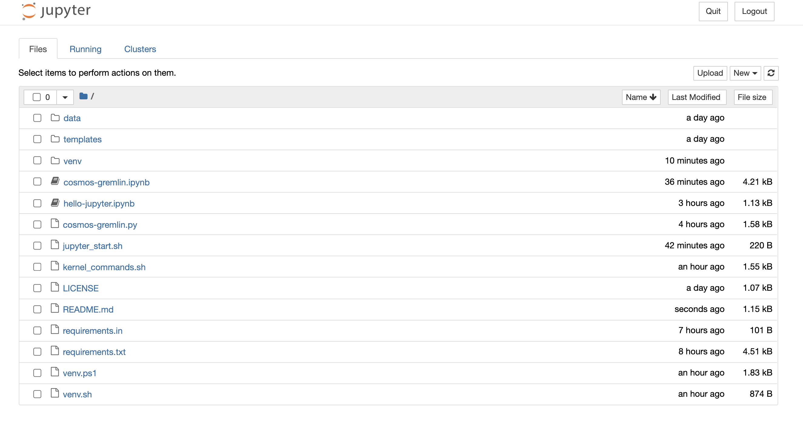
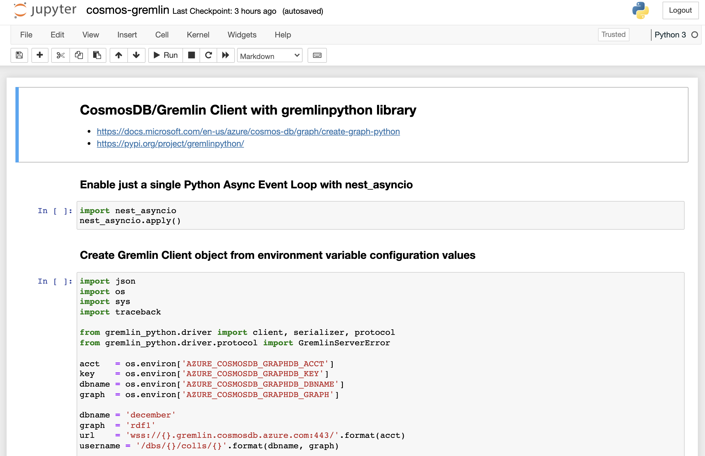

# azure-jupyter

Run **jupyter notebooks** on your laptop/workstation
and optionally access **Azure** services such as **CosmosDB**.

## Links

- https://jupyter.org/
- https://code.visualstudio.com/docs/datascience/jupyter-notebooks

## Getting Started

```
$ git clone https://github.com/cjoakim/azure-jupyter.git

$ cd azure-jupyter

$ ./venv.sh                   <-- create a python virtual environment (on linux & macOS)

$ source venv/bin/activate    <-- activate the python virtual environment

$ jupyter kernelspec list     <-- list available kernel names and locations

$ jupyter kernelspec install-self  <-- create kernel from current directory

$ ./jupyter_start.sh          <-- start the jupyter notebooks
```

In **Windows PowerShell** execute **venv.ps1** instead of venv.sh; the other commands
should be the same.

---

## Example Running Jupyter Notebooks

### Initial Page - select an ipynb notebook

<p align="center"></p>

### Running Notebook

<p align="center"></p>

---

### Unused Libraries; maybe later

- https://ipython-gremlin.readthedocs.io/en/latest/index.html
  - this is old, current version is 1.0.0 from March 2017

- https://github.com/aws/graph-notebook
  - AWS Neptune oriented

